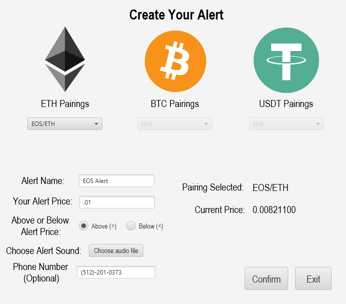
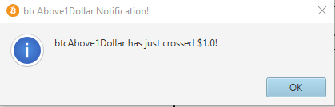

# CryptoTracker
This java desktop application allows the user to follow certain cryptocurrency pairings and set alerts for when its price goes above or below a certain price.  
At the main screen, there will always be three pairings, BTC/USD (Bitcoin to Dollar), ETH/USD (Ethereum to Dollar), LTC/USD (Litecoin to Dollar). These are permanent and cannot be removed.    
Here is what the main screen looks like:

  
The list on the side will be empty as you have no custom alerts setup yet. Setting up alerts is easy, just go to the toolbar and click "Create an Alert..."

  
From there, a new menu will appear. It will look like this:

You have three pairing choices, Ethereum, Bitcoin, and USDT. There has already been some configuration of this alert.
 
Notice ETH pairings, I have already chosen the pairing "EOS/ETH", the other drop menus are grayed out and the current price is being displayed and updated as time goes on.
 
This app does have a text alert option for when it is time to alert the user, but this is optional.
Once everything is set up to the user's specifications, clicking confirm will send a confirmation to add it to the list.
 
 
Here is the new updated list:

  
Once the alert is triggered, an alert dialog will show up on the screen and an optional text will be sent to your number. After this, the alert in the list will be removed. 
The alert dialog:

And thats how this application works, thanks for reading!
